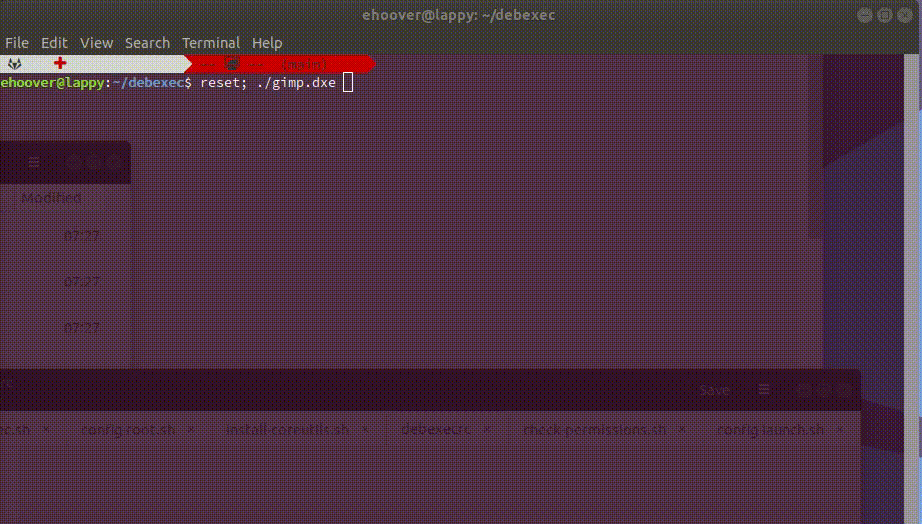
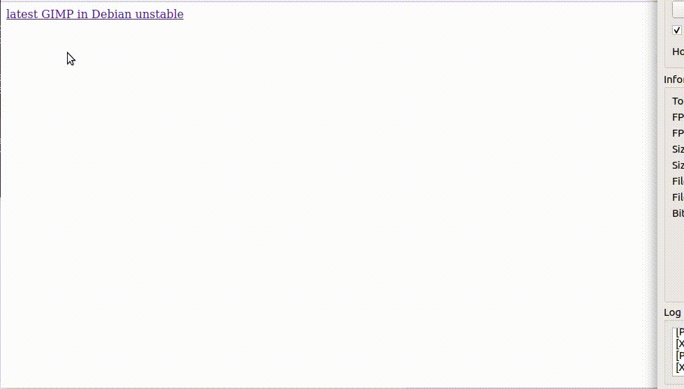

# debexec

debexec makes it easy for end users to run the latest Debian software without upgrading their OS.

## Primary Goals
* Make it easy for end users to run the latest and greatest programs
  * Allow the end user to just run the executable
    * Integrate with the desktop environment so launching software is easy
    * Use a simple "Windows Installer"-like interface to guide the user
    * Do not require any special utilities to run programs
    * Do not require administrative permissions to run programs
  * Make it easy for the user to run their software on whatever Linux system they have
  * Make generating their own packaged executables easy
* Help end users protect their systems from malicious software
  * Download packages from a trusted source (Debian repository)
  * Verify that packages came from a trusted source
  * Inform the end user when packages do not come from a trusted source
  * Restrict access to the rest of the system unless a package really needs it
  * When packages require permissions, provide a simple phone-like interface for granting permissions

## Secondary Goals
* Do not reinvent wheels
* Make it easy to distribute software for Linux

## Context
I recently upgraded to Ubuntu 22.04 and was profoundly unhappy with what Canonical has done with turning Firefox into a snap.  They have obviously designed a system that is about making their life easier, rather than end users, and I thought that I could whip up something better.

Snaps solve a distribution problem for Canonical by reducing the maintenance burden for older OS releases.  By providing software in a standardized container, they only need to make one package per new version of Firefox (or whatever constantly updating software that they have) rather than generating one for every supported old OS release.  Building the same piece of software multiple times takes up lots of build and storage resources that they do not want to spend, so this makes a certain amount of sense.

The kernel of this idea is a good one, but the end user is only an afterthought.  The reason end users are somewhat willing to put up with this is that they want to run the latest and greatest software, but they do not want to upgrade their OS all the time (all sorts of things break!).  Canonical and others have latched onto this idea and have built extensive systems around building and managing containers, which helps them avoid having to build multiple packages for software.  However, they are effectively just recreating the package management system and, at the end of the day, the user just wants to run the latest software.

## Why not Flatpak?
Flatpak solves a similar problem, and it definitely does better than snap, but its focus is still on the distributor and software developer.  If you pull up the homepage _literally every advantage they list_ is about making it easier for developers to distribute software.  Also, when you pull up Flathub all of the popular apps are either in the main Debian repository or they can be downloaded from the developer's third-party Debian repo.  So, why are we recreating all this work that already went into making all this software run on the latest Debian?

## What about AppImage?
AppImage is even more user-centric than Flatpak, but suffers from a few key problems:
1) it is still really about making it easier for developers to send out their software (see talk of "upstream packaging")
2) it is really complicated for an end user to create their own AppImage
3) resolving the dependency issues is even worse than it is with snap and Flatpak
But AppImage's heart is definitely in the right place (can run apps unprivileged, desktop integration, etc.), a lot of these issues likely stem from it being "too early" to the scene (before containers were widely available).

## Proposed Solution
Stop reinventing the wheel.  Debian provides a package manager and the absolute latest versions of virtually every piece of software you could want (and third-party repos have everything else).  Leverage all that existing infrastructure and give end users a simple way to access it.  All end users need is a front-end to Debian's "unstable" repository that behaves like a "Windows Installer" to install their software for them.  Sort of a fusion of Flatpak, AppImage, and APT.

## Examples
First-time run w/ gimp:

(little slow, but it needs to initialize the container the first time you run it)

Second-time run w/ gimp:

(~2 seconds! ... and it even checked for updates)

First-time run w/ inkscape, but already loaded w/ gimp:

(pretty darn speedy, only needs to install packages not already installed by gimp)

Second-time run w/gimp directly from Firefox:

(note: installed system-wide, but you can also download the file, set it executable, and run it from a terminal)

## End-user Requirements (easily met)
* a POSIX shell
* the "unshare" command and a kernel with unprivileged container support (part of the standard util-linux package for a long time now)
* at the moment, a Debian-based host system (demo limitation, not a technical limitation)
* optionally, python3 w/ PySide2 or PyQt5 (for GUI support, but can run with just a terminal)

## Technical Notes
* no elevated privileges are required
* almost everything uses POSIX shell commands
* a very small preloader takes care of non-user permissions (or newuidmap can be used instead)
* the packages are themselves a shell script that can be launched from the GUI or CLI
* if installed system-wide, applications can be launched directly from the browser
* software can be isolated from the main system and additional privileges (like networking) can be requested from the end user first
* "building" a package is just giving the tool a simple pbuilderrc-like text file with what packages to load and where to get them from:
```
EXTRAPACKAGES="inkscape"
DEBEXEC_LAUNCH="inkscape"
DEBEXEC_PERSIST="debian-unstable"
```
